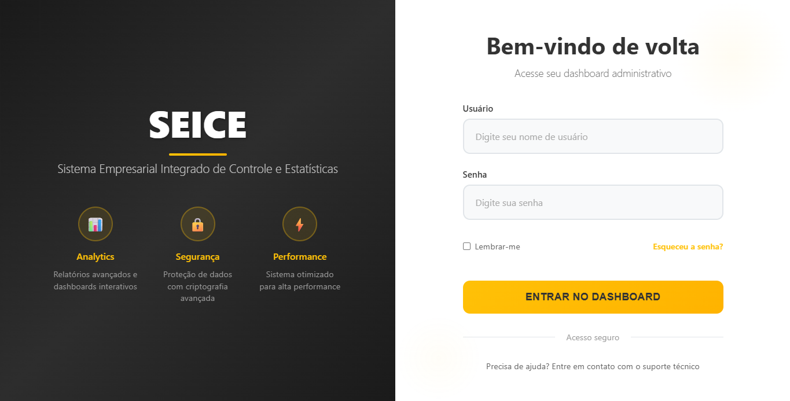
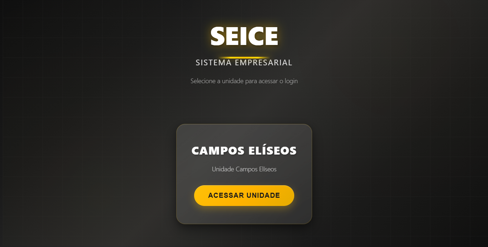
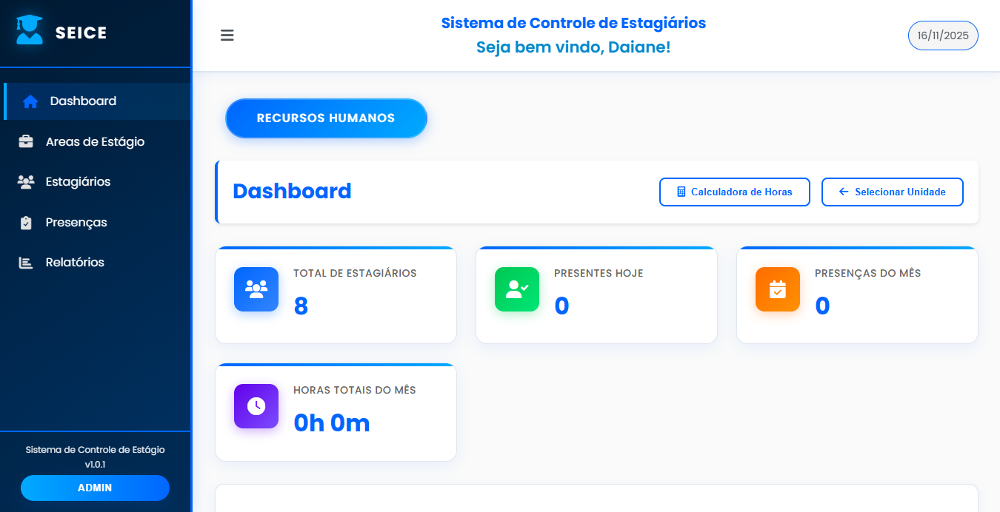
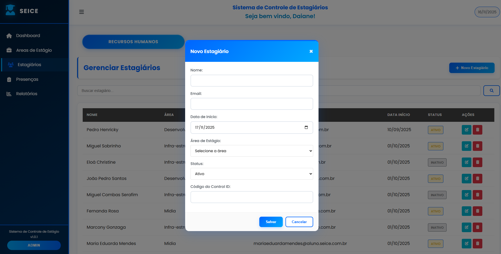
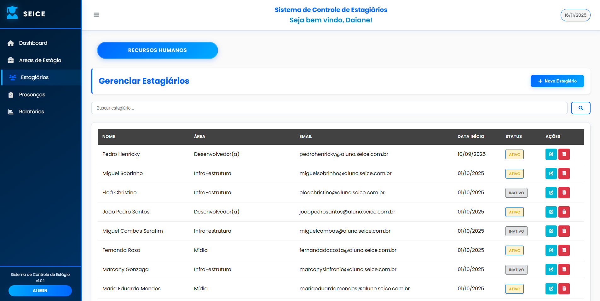
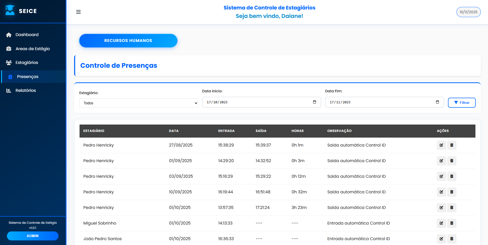
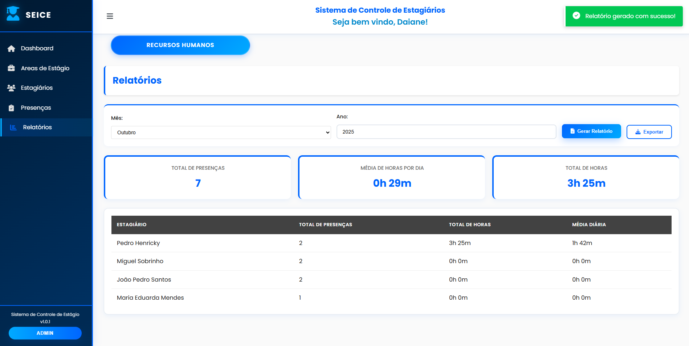

# Manual do Usuário - Sistema de Controle de Estagiários

## Sistema de Estágio e Controle de Estagiários

---

## 📋 Sobre o Sistema

O **Sistema de Controle de Estagiários** é uma aplicação web completa para gerenciar estagiários e seus registros de presença. O sistema facilita o controle de horários, frequência e relatórios, tornando mais eficiente a administração de programas de estágio.

### Principais Funcionalidades

- ✅ **Gerenciamento de Estagiários**: Cadastro, atualização e controle de status
- ✅ **Registro de Presenças**: Entrada e saída com cálculo automático de horas
- ✅ **Relatórios e Estatísticas**: Análises de frequência e produtividade
- ✅ **Integração com Control ID**: Sincronização automática de presenças via reconhecimento facial
- ✅ **Controle de Acesso**: Sistema seguro com permissões por unidade e setor
- ✅ **Painel Administrativo**: Configuração avançada do sistema

---

## 📸 Espaço para Prints do Sistema

### Tela de Login

## Gerenciamento de Unidades

### Painel Principal

### Cadastro de Estagiário

### Lista de Estagiários

### Lista de Presenças

### Relatório de Frequência

---

## 🚀 Como Começar

### 1. Acesso ao Sistema

1. Abra seu navegador web
2. Acesse: `http://[endereço-do-servidor]:8000`
3. Faça login com suas credenciais

### 2. Primeiro Acesso

Após o login, você será direcionado para o painel da sua área/setor.

---

## 🔐 Painel Administrativo (Django Admin)

O **Painel Administrativo** é a área de configuração avançada do sistema, acessível apenas para administradores. Aqui são gerenciados usuários, unidades, permissões e configurações do sistema.

### Como Acessar o Painel Admin

1. Clique no botão Admin no painel lateral do sistema após fazer login
2. OU Acesse: `http://[endereço-do-servidor]:8000/admin/`
3. Faça login com credenciais de administrador
4. Você verá o painel principal com todas as opções de gerenciamento

### Gerenciamento de Usuários

#### Criando Usuários do Sistema

1. No painel admin, clique em **"Usuarios"**
2. Clique em **"Adicionar usuario"**
3. Preencha os dados:
   - **Nome**: Nome completo do usuário
   - **Area**: Setor do usuário (tecnologia, rh, pedagogia, etc.)
   - **Login**: Nome de usuário para login
   - **Senha**: Senha de acesso
4. Clique em **"Salvar"**

#### Vinculando Usuário a Unidade

Após criar o usuário, é necessário vinculá-lo a uma unidade:

1. Clique em **"Usuario unidades"**
2. Clique em **"Adicionar usuario unidade"**
3. Selecione:
   - **Usuario**: O usuário criado
   - **Unidade**: A unidade onde trabalha
   - **Nivel acesso**: "leitura" ou "admin"
4. Clique em **"Salvar"**

### Gerenciamento de Unidades

#### Criando Unidades

1. Clique em **"Unidades"**
2. Clique em **"Adicionar unidade"**
3. Preencha:
   - **Nome**: Nome da unidade (ex: "Colégio SEICE - Primavera")
4. Clique em **"Salvar"**

### Gerenciamento de Áreas

#### Criando Áreas

1. Clique em **"Areas"**
2. Clique em **"Adicionar area"**
3. Preencha:
   - **Nome**: Nome da área (ex: "Desenvolvimento Web")
   - **Setor**: Setor correspondente
   - **Unidade**: Unidade da área
4. Clique em **"Salvar"**

### Gerenciamento de Estagiários (via Admin)

O painel admin permite visualizar e editar todos os estagiários:

- **Lista de Estagiários**: Visualizar todos os cadastrados
- **Edição Rápida**: Alterar status ativo/inativo diretamente na lista
- **Controle de Control ID**: Gerenciar IDs de integração

### Gerenciamento de Presenças (via Admin)

- **Visualizar Todas as Presenças**: Lista completa de registros
- **Editar Presenças**: Corrigir horários se necessário
- **Ações em Massa**: Marcar múltiplas presenças como confirmadas

### Controle de Coleta de Logs (via Admin)

A tabela **"Controle coleta logs"** gerencia a sincronização automática com o Control ID:

- **Ultimo timestamp**: Último log processado do Control ID
- **Ultimo log id**: ID único do último log processado
- **Total processados**: Contador total de logs processados
- **Processed log ids**: Lista de IDs já processados (evita duplicatas)

**Nota**: Esta configuração é gerenciada automaticamente pelo sistema. Não altere manualmente.

### Permissões e Segurança

- **Controle por Unidade e área**: Usuários só acessam dados da sua área (exceto RH)

- **Logs de Auditoria**: Todas as ações no admin são registradas

---

## 👥 Gerenciamento de Estagiários

### Cadastro de Estagiários

**IMPORTANTE**: O cadastro de estagiários é feito em **DUAS ETAPAS**:

#### Etapa 1: Cadastro no Control ID (Sistema de Hardware)

1. Acesse o painel do **Control ID** (sistema de reconhecimento facial)
2. Cadastre o estagiário no dispositivo:
   - Nome completo
   - Foto para reconhecimento facial
   - **Anota o ID gerado pelo Control ID** (este ID será usado no Sistema de controle de estágiarios)

#### Etapa 2: Cadastro no Sistema de controle de estágiarios (Sistema Web)

1. No SEICE, vá para **"Gerenciar Estagiários"**
2. Clique em **"Novo Estagiário"**
3. Preencha os dados:
   - **Nome**: Nome completo
   - **Email**: Email institucional
   - **Setor**: Tecnologia, Financeiro, Pedagogia, etc.
   - **Área**: Área específica dentro do setor
   - **Unidade**: Unidade organizacional
   - **Data de Início**: Quando começou o estágio
   - **ID do Control ID**: O ID anotado na Etapa 1
   - **Ativo**: Marque se está ativo

4. Clique em **"Salvar"**

**Por que o cadastro duplo?**
- O **Control ID** é o hardware que reconhece o rosto e registra entrada/saída
- O **Sistema de controle de Estágiarios** é o sistema que armazena dados pessoais e gera relatórios
- A integração permite que as presenças sejam registradas 
- Isso será mudado na próxima versão do software, onde instalaremos um cadastro integrado único

### Editando Estagiários

1. Na lista de estagiários, clique no botão **"Editar"**
2. Modifique os dados necessários
3. Clique em **"Salvar"**

### Inativando/Ativando Estagiários

- Use o campo **"Ativo"** para controlar o status
- Estagiários inativos não aparecem nos relatórios atuais

---

## 📊 Controle de Presenças

### Presenças Automáticas (via Control ID)

**Como funciona:**
- Quando o estagiário passa pelo Control ID, o sistema registra automaticamente
- O Sistema coleta esses dados periodicamente
- Não é necessário registro manual

### Visualizando Presenças

- **Lista de Presenças**: Veja todas as presenças por data
- **Filtro por Período**: Selecione datas específicas
- **Relatórios**: Gere relatórios detalhados

---

## 📈 Relatórios e Estatísticas

### Tipos de Relatório

1. **Relatório de Frequência**
   - Presenças por período
   - Total de horas trabalhadas

2. **Estatísticas por Estagiário**
   - Média diária de horas
   - Dias trabalhados

3. **Relatório Geral**
   - Visão geral de todos os estagiários

### Como Gerar Relatórios

1. Vá para **"Relatórios"**
2. Selecione o tipo de relatório
3. Escolha o período
4. Clique em **"Gerar"**
5. Exporte para um arquivo

---

## ⚙️ Configurações do Sistema

### Controle de áreas

Cada usuário tem acesso limitado à sua área:
- RH: Acesso a todas as áreas
- Outros setores: Apenas sua área

---

## 🔧 Área Técnica

### Requisitos do Sistema

- **Servidor**: Python 3.8+ em rede local
- **Banco de Dados**: SQLite
- **Hardware**: Control ID conectado à rede

### Integração com Control ID

**Configurações de Rede:**
- IP do Control ID: `192.168.3.40`
- Porta: `81`
- Credenciais: `admin` / `admin`

**API Endpoints:**
- Login: `POST /login.fcgi`
- Carregar Objetos: `POST /load_objects.fcgi`

### Estrutura do Banco de Dados

#### Tabelas Principais

- **Usuario**: Usuários do sistema
- **Unidade**: Unidades organizacionais
- **Area**: Áreas dentro dos setores
- **Estagiario**: Dados dos estagiários
- **Presenca**: Registros de entrada/saída
- **ControleColetaLogs**: Controle da sincronização

#### Campos Importantes

- `control_id_user_id`: ID do usuário no Control ID
- `presente`: Status atual (true/false)
- `ativo`: Estagiário ativo/inativo

### Logs e Monitoramento

O sistema registra logs detalhados:
- Conexões com Control ID
- Processamento de presenças
- Erros e alertas

### Solução de Problemas

**Problema: Presenças não estão sendo registradas automaticamente**
- Verifique se o Control ID está ligado e conectado à rede
- Confirme se o ID do Control ID está correto no cadastro
- Verifique os logs do sistema

**Problema: Erro de conexão com Control ID**
- Verifique IP e porta do dispositivo
- Teste conectividade: `ping 192.168.3.40`
- Confirme credenciais de acesso

---

## 📞 Suporte

Para dúvidas ou problemas:

- **Email**: henrickypedro.barbosa@gmail.com
- **Telefone**: (21) 98254 5629

---

## 📝 Notas de Versão

### Versão 1.0.0
- ✅ Cadastro de estagiários
- ✅ Controle de presenças
- ✅ Integração básica com Control ID
- ✅ Relatórios simples

### Melhorias Planejadas
- 📋 Cadastro único
- 📊 Cadastro de dias de trabalho
- 🔄 Sincronização em tempo real
- 📧 Notificações por email
- 📝 Anotação automática de faltas
- ☁️ Sistema em nuvem (acessível de qualquer lugar)
- 📈 Mais formatos e insights nos relatórios

Estamos abertos a receber feedbacks para melhorias e mudanças.

---

*Última atualização: Novembro 2025*
